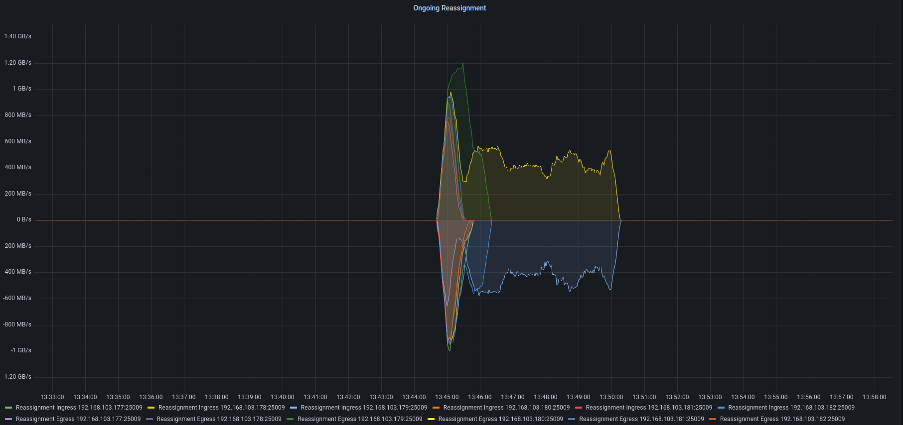
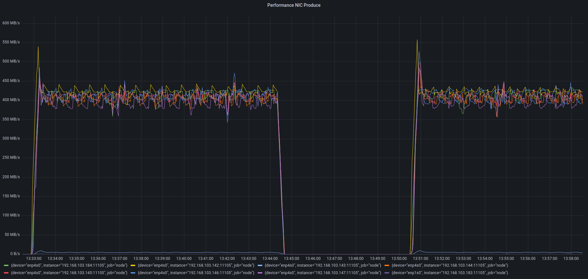
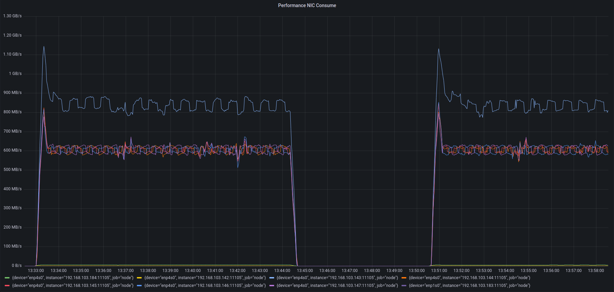
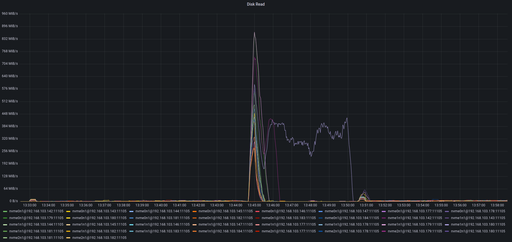

# Astraea Balancer 測試 (Data Skew 情境) #3

這個實驗是基於 [Backbone Imbalance Scenario](https://github.com/skiptests/astraea/issues/1424) 叢集情境測試，
這個情境模擬叢集中存在一個非常高流量的骨幹 ，且該 Topic 有特定的 Record Key 有較高的出現頻率
（基於 Zipfian Distribution），這導致該 Topic 的 Partition 之間存在負載不均的現象。

這個實驗中我們實驗了 Astraea Balancer 對該叢集做負載平衡，得到了以下的結果。

* 節點讀取效能平衡程度改善 78.1 %
* 節點寫入效能平衡程度改善 97.6 %
* 每個節點負責的 Partition 數量介於平均量 ± 30%

## 叢集硬體環境

這次實驗中總共涉及 15 台設備

* 7 台 Kafka Broker 節點, 其中 1 台擔任 Controller。
* 7 台 Kafka Producer/Consumer 節點
* 1 台普通的電腦，執行 Astraea Balancer

下圖為網路示意圖：

```
                                                                         [500 Mbits Router]
                                                                        ┌──────────────────┐
                               [10 Gbits Switch]                        │                  │
   ┌─────┬─────┬─────┬─────┬─────┬─────┬─────┬─────┬─────┬─────┬─────┬──┴──┬─────┐         │
   B1    B2    B3    B4    B5    B6    Ctl   P1    C1    PC2   PC3   PC4   PC5   PC6    Balancer
```

每個機器負責執行的軟體：

* B1: Kafka Broker, Node Exporter
* B2: Kafka Broker, Node Exporter
* B3: Kafka Broker, Node Exporter
* B4: Kafka Broker, Node Exporter
* B5: Kafka Broker, Node Exporter
* B6: Kafka Broker, Node Exporter
* Ctl: Kafka KRaft Controller, Prometheus, Node Exporter
* P1: Performance Tool(Producer, Skew Data Source), Node Exporter
* C1: Performance Tool(Consumer, Skew Data Source), Node Exporter
* PC2: Performance Tool(Producer & Consumer), Node Exporter
* PC3: Performance Tool(Producer & Consumer), Node Exporter
* PC4: Performance Tool(Producer & Consumer), Node Exporter
* PC5: Performance Tool(Producer & Consumer), Node Exporter
* PC6: Performance Tool(Producer & Consumer), Node Exporter
* Balancer: 執行 Astraea Balancer 的機器

下表為 B1, B2, B3, B4, B5, B6 的硬體規格：

| 硬體項目 | 型號                                                                       |
|------|--------------------------------------------------------------------------|
| CPU  | Intel i9-12900K CPU 3.2G(5.2G)/30M/UHD770/125W                           |
| 主機板  | 華碩 ROG STRIX Z690-G GAMING WIFI(M-ATX/1H1P/Intel 2.5G+Wi-Fi 6E)14+1相數位供電 |
| 記憶體  | 美光Micron Crucial 32GB DDR5 4800                                          |
| 硬碟*3 | 威剛XPG SX8200Pro 1TB/M.2 2280/讀:3500M/寫:3000M/TLC/SMI控                    |
| 網路卡  | XG-C100C [10Gigabit埠] RJ45單埠高速網路卡/PCIe介面                                 |

下表為 Ctl(Kafka KRaft Controller) 的硬體規格：

| 硬體項目  | 型號                                                    |
|-------|-------------------------------------------------------|
| CPU   | Intel i7-11700K [8核/16緒] 3.6GHz(5.0G)/16M/UHD750/125W |
| 主機板   | 技嘉Z590M GAMING X(M-ATX/1H1P/Realtek 2.5G)12+1相數位供電    |
| 記憶體   | 金士頓 32G(16G2)D4-3200(KF432C16BB1K2/32)(10248)         |
| 硬碟*2  | ADATA 威剛 XPG SX8200Pro 1 TB M.2 2280 PCIe SSD * 2     |
| 散熱器   | 快睿H7 散熱器/蜂巢式鰭片/6mm導管*3/高14.5cm/TDP:140W               |
| 電源供應器 | Antec NE550G(550W) 金牌/半模/全日系/LLC+DC-DC                |
| 網卡    | XG-C100C [10Gigabit埠] RJ45單埠高速網路卡/PCIe介面              |

下表為 P1, C1, PC2, PC3, PC4, PC5, PC6 的硬體規格：

| 硬體項目  | 型號                                                |
|-------|---------------------------------------------------|
| CPU   | Intel Core i7-13700K Processor                    |
| 主機板   | 華碩 PRIME Z790-P WIFI-CSM                          |
| 記憶體   | 海盜船 Corsair 統治者 DDR5-5600 16GB * 2                |
| 硬碟*2  | ADATA 威剛 XPG SX8200Pro 1 TB M.2 2280 PCIe SSD * 2 |
| 散熱器   | Cooler Master MasterLiquid ML240L V2 ARGB         |
| 電源供應器 | Cooler Master New GX 金牌 850W                      |
| 網卡    | XG-C100C [10Gigabit埠] RJ45單埠高速網路卡/PCIe介面          |

下表為執行 Balancer 的設備之硬體規格：

| 硬體項目 | 型號                                                   |
|------|------------------------------------------------------|
| CPU  | 11th Gen Intel(R) Core(TM) i7-11700K @ 3.60GHz       |
| 記憶體  | KLEVV DIMM DDR4 Synchronous 2667 MHz (0.4 ns) 16GB*2 |
| 主機板  | MAG B560 TOMAHAWK WIFI (MS-7D15)                     |

## 叢集軟體環境

* Apache Kafka version 3.4.0， 各個節點包含 3 個 log dir，每個有 844GB 空間的 SSD
* Astraea Balancer (revision ced840f9ded6e4167ccbbc86a20f79f7ec6be0c0)

### 建立 Kafka 叢集

請依照上述的環境建立叢集，您可以使用專案內的
[./docker/start_broker.sh](https://github.com/skiptests/astraea/blob/ced840f9ded6e4167ccbbc86a20f79f7ec6be0c0/docker/start_broker.sh) 和
[./docker/start_controller.sh](https://github.com/skiptests/astraea/blob/ced840f9ded6e4167ccbbc86a20f79f7ec6be0c0/docker/start_controller.sh) 來建立叢集。

## 效能資料攝取

整個實驗的效能指標數據源自每個 Kafka Broker 的 JMX 資訊，這些資訊透過 jmx_exporter 輸出成 Prometheus 能夠接受的格式，
接著以 Grafana 繪圖觀察。實驗過程中我們也有關心實際硬體資源的使用情況，這部分我們透過在每個硬體設備啟動的 node exporter 和 Prometheus，
進行底層硬體效能資料的攝取。

您可以使用專案內的
[./docker/start_node_exporter.sh](https://github.com/skiptests/astraea/blob/ced840f9ded6e4167ccbbc86a20f79f7ec6be0c0/docker/start_node_exporter.sh),
[./docker/start_prometheus.sh](https://github.com/skiptests/astraea/blob/ced840f9ded6e4167ccbbc86a20f79f7ec6be0c0/docker/start_prometheus.sh) 和
[./docker/start_grafana.sh](https://github.com/skiptests/astraea/blob/ced840f9ded6e4167ccbbc86a20f79f7ec6be0c0/docker/start_grafana.sh) 來建構監控環境。

## 建立情境

參考 https://github.com/skiptests/astraea/issues/1424 敘述的情境，建立對應的實驗環境

## 執行實驗

首先取得 Astraea Project

```script
git clone https://github.com/skiptests/astraea.git
cd astraea
git checkout ced840f9ded6e4167ccbbc86a20f79f7ec6be0c0
```

接著執行 Astraea Web Service，Astraea Web Service 提供一系列的功能，能幫助我們對 Kafka 進行管理和操作。

執行 `./gradlew run --args="web --bootstrap.servers <broker-addresses>"` 來使用 web service，其中 `<broker-addresses>` 是
Kafka 對外服務的網路位置。

宣告要使用的 Sensor

```shell
curl -X POST --location "http://localhost:8001/sensors" \
    -H "Content-Type: application/json" \
    -d '{
       '  "costs": [
            "org.astraea.common.cost.NetworkIngressCost",
            "org.astraea.common.cost.NetworkEgressCost"
          ]
        }'
```

對 Astraea Balancer 發送 `POST /balancer` HTTP Request， 請 Balancer 計算負載平衡計劃。

```shell
curl -X POST --location "http://localhost:8001/balancer" \
    -H "Content-Type: application/json" \
    -d '{
          "timeout": "120s",
          "balancer": "org.astraea.common.balancer.algorithms.GreedyBalancer",
          "balancerConfig": {
            "shuffle.tweaker.min.step": 1,
            "shuffle.tweaker.max.step": 5
          },
          "clusterCosts": [
            { "cost": "org.astraea.common.cost.NetworkIngressCost", "weight": 1 },
            { "cost": "org.astraea.common.cost.NetworkEgressCost", "weight": 1 }
          ]
    }'
```

執行完成後後會在 terminal 上印出負載平衡計劃的編號：

```shell
# Something like this: {"id":"9b25bf14-a885-4c5b-97bf-59ff025b61d2"}
{"id":"Your-Balance-Plan-Id"}
```

之後可以透過 `GET /balancer/Your-Balance-Plan-Id` 來查詢關於這個計劃的狀態，比如這個計劃是否生成完成，或是已經排程執行。

```shell
curl -X GET http://localhost:8001/balancer/46ecf6e7-aa28-4f72-b1b6-a788056c122a

# {
#   "id": "46ecf6e7-aa28-4f72-b1b6-a788056c122a", // 計劃的編號
#   // 搜尋計劃細節
#   "config": {    
#     "balancer": "org.astraea.common.balancer.algorithms.GreedyBalancer",
#     "function": "WeightCompositeClusterCostFunction[{\"NetworkIngressCost\" weight 1.0}, {\"NetworkEgressCost\" weight 1.0}]",
#     "timeout": "120000ms"
#   },
#   "phase": "Searched",  // 計劃狀態
#   "plan": { ... }       // 關於這個計劃的細節，計劃生成後才會有此詳細資訊
# }
```

如果 `GET /balancer/Your-Balance-Plan-Id` 回傳結果中 `phase` 為 `Searched`， 則代表計劃已經完成生成。

> 如果計劃生成失敗，可以檢查 `exception` 欄位的訊息，或是查看 Web Service 是否有印出錯誤的資訊，來做進一步的診斷。

計劃成功生成後，可以透過 `PUT /balancer` 來執行負載平衡的計劃。

這個實驗的情境是執行於叢集的歲修期間，因此這個時候叢集的 Client 會暫時停止運作。

等 Client 停止運作後執行下面的 PUT Request 來執行 Balancer 負載優化計劃。

```shell
curl -X PUT http://localhost:8001/balancer \
    -H "Content-Type: application/json" \
    -d '{ "id": "Your-Balance-Plan-Id" }'
```

過程中可以透過 `GET /balancer/Your-Balance-Plan-Id` 來檢查執行的狀態，當輸出結果中的 `phase` 為 `Executed` 時意味著計劃已經完成執行。

> 如果計劃執行失敗，可以檢查 `exception` 欄位的訊息，或是查看 Web Service 是否有印出錯誤的資訊，來做進一步的診斷。

> 詳細的 `/balancer` API 文件，可以參考[這裡](https://github.com/skiptests/astraea/blob/ced840f9ded6e4167ccbbc86a20f79f7ec6be0c0/docs/web_server/web_api_balancer_chinese.md)

## 實驗執行結果

### Broker Ingress


| 狀態  | 節點最高吞吐量  | 節點最低吞吐量  | 負載平衡程度 |
|-----|----------|----------|--------|
| 執行前 | 529 MB/s | 333 MB/s | 37.0 % |
| 執行後 | 404 MB/s | 371 MB/s | 8.1 %  |

節點讀取效能平衡程度改善 78.1 %

### Broker Egress


| 狀態  | 節點最高吞吐量  | 節點最低吞吐量  | 負載不平衡比例 |
|-----|----------|----------|---------|
| 執行前 | 666 MB/s | 468 MB/s | 29.7 %  |
| 執行後 | 517 MB/s | 513 MB/s | 0.7 %   |

節點寫入效能平衡程度改善 97.6 %

### Partition 數量


| 狀態  | 節點最高 Partition 數量 | 節點最低 Partition 數量 | 平均值  | 最大差異%  |
|-----|-------------------|-------------------|------|--------|
| 執行前 | 1693              | 1649              | 1669 | 1.4%   |
| 執行後 | 1832              | 1378              | 1669 | 17.4 % |

每個節點負責的 Partition 數量介於平均量 ± 30%

### Ongoing Reassignment



總共觸發了一次 Reassignment，執行時間約 5 分 30 秒

### Producer/Consumer Client 流量




整個執行過程沒有額外瓶頸導致的吞吐量下降現象。

### 節點的硬碟讀寫吞吐量



可以注意到節點的硬碟，只有在搬移時出現讀取的流量，如果您重現實驗時，在搬移之外的階段就出現讀取的吞吐量，
這意味著目前的實驗環境 Consumer 可能沒辦法跟上消費的進度，此時可能要檢視硬體配置或 Producer/Consumer 參數是否正確。
