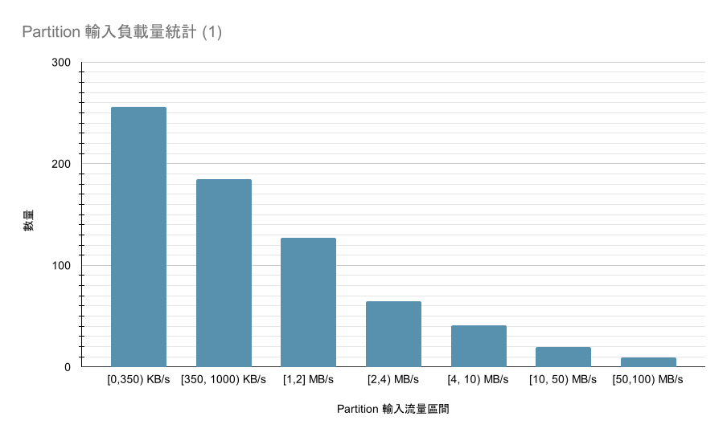
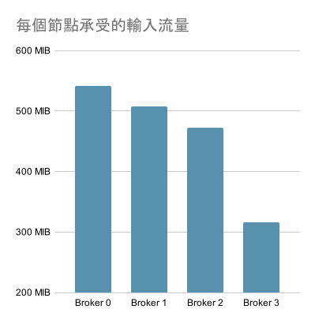
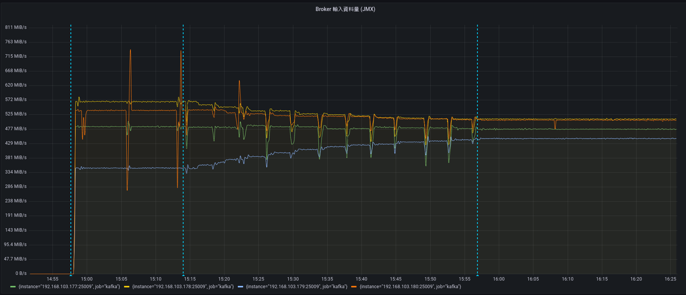
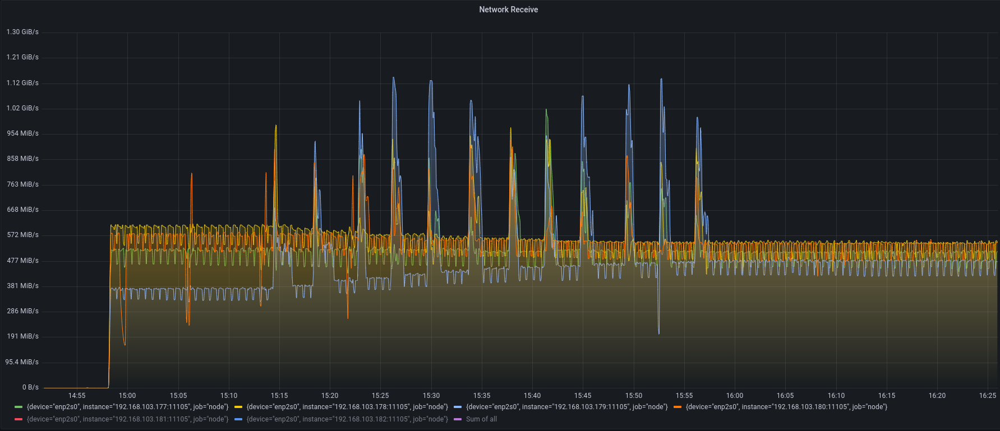

# Astraea Balancer 測試 #1

這個測試展示目前的 Astrara Balancer 能在特定的系統環境中，平衡叢集節點所承受的輸入資料量。

在這次實驗中，我們的 Astraea Balancer 得到了以下結果：

* 在負載平衡之前，節點承受的輸入資料量差距最高達到 210 MiB/s，經過負載平衡後，整個承受的資料量差距變成約 44 MiB/s。
* 負載平衡過程產生的 IO 成本，給 Produce 應用帶來些許影響。

## 測試情境

我們在我們既有的硬體環境中，建立一個 Apache Kafka 叢集，在此叢集上，透過 Apache Kafka 官方提供的 [AdminClient](https://kafka.apache.org/32/javadoc/org/apache/kafka/clients/admin/AdminClient.html) 函式庫的  [AdminClient#createTopics](https://kafka.apache.org/32/javadoc/org/apache/kafka/clients/admin/Admin.html#createTopics(java.util.Collection)) 函數和 [AdminClient#deleteTopics()](https://kafka.apache.org/32/javadoc/org/apache/kafka/clients/admin/Admin.html#deleteTopics(java.util.Collection)) 函數，建立和刪除若干測試 Topics 以產生模擬環境，整個過程中產生的 Topic Log 分佈（負載分佈）完全源自 Apache Kafka 的原生 API 邏輯，在這個 Log 分佈下，我們依照特定機率分佈指定每個 Topic/Partition 需要輸入的固定速度的資料。在這個情境下，我們嘗試模擬出一個存在負載不平衡情況的 Apache Kafka 叢集。針對這個負載不平衡的叢集，我們啟動現行的 Astraea Balancer 實作，嘗試平衡 Produce 資料量負載不平衡情況。

以下內容包含

1. [叢集軟體環境](#叢集軟體環境)：我們的 Apache Kafka 叢集規模和 Client 數量。
2. [測試情境生成](#測試情境生成)：敘述我們如何產生測試環境的負載分佈，我們採用。
   * [這個檔案敘述我們的情境中的所有 Topic 的 Log 分佈](./resources/experiment_1_allocation.json)。
   * [這個檔案敘述每個 Topic/Partition 接受的 Produce 資料量](./resources/experiment_1_produce_loading.json)。
   * 所有 topic 有套用 `retention.size=5000000000`
3. [Producer 實作](#Producer 實作)：敘述我們使用的 Producer 實作，這個實作的目標是確保資料能穩定地以固定速度輸入。
4. [硬體和網路環境](#硬體和網路環境)：我們測試環境的硬體規格和網路拓樸。
5. [叢集效能資料索取](叢集效能資料索取)：我們如何索取和觀察效能資訊。

### 叢集軟體環境

這個實驗中包含

* 4 個 Apache Kafka Broker 節點（version 3.2.1）。
* 1 個 Zookeeper 節點（version 3.7.0）。
* 98 個 Producer Instance 負責讀寫資料。

### 測試情境生成

如同先前的情境敘述，我們的 Log 分佈完全產生自 Apache Kafka 原生的實作，對此我們寫了一個工具來依照特定的機率分佈來產生 Topic Log 分佈和他們對應的輸入資料形式，這些產生的 Topic 被用來模擬生產環境中的使用情境。我們這邊的機率分佈背後其實有兩個群，這兩個群分別代表不同的 Topic 工作情境，每個工作情境代表一種潛在的 Apache Kafka 用法，我們將這兩個工作情境設計為：

1. AdHoc 形式工作情境
    * 一些簡易的工作情境，被使用者隨意打開以應付暫時需求的 Topic
    * 假設這類型的 Topic 經常被建立，每天（程式模擬時間）大約會建立 5 ~ 15 個
    * Topic 相對短命 （建立後，過幾天就會從叢集刪除）
    * Partition 數量為 3 ~ 10 之間隨機值
    * Replica 數量以 1 較為常見，有可能有更高的值但背後機率不高
    * 傳輸的資料量有大有小
2. LongRun 形式工作情境
    * 主要的資料管線，建立後基本上不太會移除
    * 這類的 Topic 不常建立，背後為 BinomialDistribution，在我們的情境中大約會建立 10 個
    * Topic 不會被移除
    * Partition 數量相對較多
    * Replica 數量以 1 較為常見
    * 傳輸的資料量通常很大

我們以上述的情境來模擬一個經過一段時間運行的叢集，經過挑選後挑出下面這個存在負載不平衡情境的環境，對其當做我們的測試對象。

下面連結是兩個 JSON File，內容包含 (1) log 在測試環境中的分佈和 (2) 每個 Topic/Partition 接受的資料量。

* [這個檔案敘述我們的情境中的所有 Topic 的 Log 分佈](./resources/experiment_1_allocation.json)。
* [這個檔案敘述每個 Topic/Partition 接受的 Produce 資料量](./resources/experiment_1_produce_loading.json)。

* 下方是關於這個情境的一些統計資訊。

| 統計項目   | 數量   |
| ---------- | ------ |
| Topics     | 95 個  |
| Partitions | 803 個 |
| Replicas   | 917 個 |



上圖展示這 803 個 Partition 對應的輸入資料量之間距合，可以看到絕大多數的 Topic/Partition 都是屬於小輸入資料量的 （介於 0 ~ 350 KB/s），而另外有少數給個骨幹 Topic/Partition 承受相對高的資料量（50 ~ 100 MB/s）。



上圖是這 4 個節點在我們產生的分佈下，每個節點預計會承受的負載量。由於 Apache Kafka 建立 Topic 時的負載分配方法為以 Log 數量進行分配，在這個沒有考慮到 Partition 間可能存在 Skewed Loading 的情境，可能會出現這種負載不平衡的現象。Log 的大小會明顯左右負載平衡所需的時間，在這裡我們對每個 Topic 套用了 5 GB 的 `retention.size`，每個 Topic 儲存超過這個大小的資料將會被清除，這個設定會間接影響負載平衡的搬移成本上限。

### Producer 實作

為了確保實驗過程的穩定性，我們寫了一個特製的 Producer，他能夠在我們的環境和我們的情境中精確地做到每秒特定流量的資料輸入。

https://github.com/garyparrot/astraea/blob/loading/app/src/main/java/org/astraea/app/loading/ProduceLoading2.java

### 硬體和網路環境

下圖為網路示意圖：

```
                                    [Router]
                              ┌──────────────────┐
         [10 Gbits Switch]    │                  │
   ┌─────┬─────┬─────┬─────┬──┴──┐               │
   B1    B2    B3    B4    P1    P2           Balancer
```

每個機器負責執行的軟體：

* B1: Kakfa Broker, Zookeeper, Prometheus, Node Exporter
* B2: Kafka Broker, Node Exporter
* B3: Kafka Broker, Node Exporter
* B4: Kafka Broker, Node Exporter
* P1: 48 個 Producer Client, Node Exporter
* P2: 48 個 Producer Client, Node Exporter
* Balancer: 執行 Astraea Balancer 的機器

下表為 B1, B2, B3, B4, P1, P2 的硬體規格：

| 硬體項目 | 型號                                                         |
| -------- | ------------------------------------------------------------ |
| CPU      | Intel i9-12900K CPU 3.2G(5.2G)/30M/UHD770/125W               |
| 主機板   | 華碩 ROG STRIX Z690-G GAMING WIFI(M-ATX/1H1P/Intel 2.5G+Wi-Fi 6E)14+1相數位供電 |
| 記憶體   | 美光Micron Crucial 32GB DDR5 4800                            |
| 硬碟     | 威剛XPG SX8200Pro 1TB/M.2 2280/讀:3500M/寫:3000M/TLC/SMI控 * 3 |
| 網路卡   | XG-C100C [10Gigabit埠] RJ45單埠高速網路卡/PCIe介面           |

下表為執行 Astraea Balancer 的設備之硬體規格：

| 硬體項目 | 型號                                                 |
|------|------------------------------------------------------|
| CPU  | 11th Gen Intel(R) Core(TM) i7-11700K @ 3.60GHz       |
| 記憶體  | KLEVV DIMM DDR4 Synchronous 2667 MHz (0.4 ns) 16GB*2 |
| 主機板  | MAG B560 TOMAHAWK WIFI (MS-7D15)                   |

### 叢集效能資料索取

整個實驗的效能指標數據源自每個 Kafka Broker 的 JMX 資訊，這些資訊透過 jmx_exporter 輸出成 Prometheus 能夠接受的格式，接著以 Grafana 繪圖觀察。實驗過程中我們也有關心實際硬體資源的使用情況，這部分我們透過在每個節點啟動的 node exporter 和 Promethues， 進行底層硬體效能資料的攝取。

## 實驗數據

透過我們的觀測工具，觀察四臺 Apache Kafka Broker 的輸入資料量。我們撰寫 `rate((kafka_server_bytesinpersec + kafka_server_replicationbytesinpersec - kafka_server_reassignmentbytesinpersec)[$interval:$interval])` 這個 PromQL 來得知每個節點各時間點所承受的輸入資料量(在我們的情境 `$interval` 為 10 seconds)。



上圖中的（左邊數來）第一條藍線，其時間點為 Producer Clients 啟動的時機，我們從該時機點開始對叢集輸入資料。經過約 15 分鐘後，我們啟動我們的 Astraea Balancer，於第二條藍線開始進行負載平衡。我們讓 Astraea Balancer 執行大約 40 分鐘左右，過程中觸發 12 次搬移手續。最終得到第三條藍線下，各給節點的效能相對較平均的狀態。

**在負載平衡之前，節點承受的輸入資料量差距最高達到 210 MiB/s，經過負載平衡後，整個承受的資料量差距變成約 44 MiB/s。**



上圖是執行 `rate(node_network_receive_bytes_total{device="enp2s0"}[$interval])` 這個 PromQL 後得到。此為每個節點從網路卡的角度看到的輸入流量（不同於上圖，從 Broker 的角度看單純資料的流入），可以看到整個運作的過程中有幾許 Spikes，這些是搬移造成的額外負載。


上圖是 `rate(node_network_transmit_bytes_total{device="enp2s0"}[$interval])` 這個 PromQL 的結果。此為針對 P1, P2 節點在整個過程中網路卡的輸出資料量進行繪圖，可以看到整個過程中 Producers 大多數時間都有穩定輸入資料，不過在負載平衡的過程中有造成一定的負載影響，這個影響源自於目前的實作還沒有套用 Throttle 機制，來避免負載平衡伴隨的 IO 成本影響現有服務。

## 測試結論

這次測試中，我們在既有的硬體環境，針對 Apache Kafka 正規手續產生的叢集負載分佈和以一定機率分佈下產生的 Workflow，進行 Produce 流量的平衡測試，我們在在過程中看到各個節點的輸入流量得到了一定的進步。